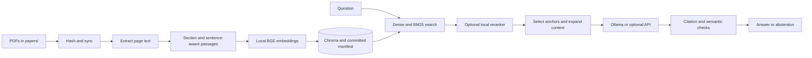

# Scholar Frog architecture

## Flow

`app.py` serves a local browser UI on `127.0.0.1:8765`. `ask.py` provides the CLI. Both call the same modules in `src/`; neither owns search or generation rules.

## Index and library

`src/ingest.py` extracts Markdown per page with `pymupdf4llm`, falling back to PyMuPDF plain text. It removes repeated margins, retains headings and exact page offsets, and makes sentence-aware passages within the embedding model's token limit. Image-only PDFs have no OCR path.

`src/sync.py` hashes PDF bytes and reconciles additions, changes, renames, duplicates, and deletions. Chroma stores local embeddings, passages, and page context. A manifest records committed chunk IDs; retrieval ignores pending and orphan rows. Writes are staged, verified, then made visible by the manifest. Failed replacements keep the previous committed version. `chroma_db/` and `papers/` are ignored by Git.

`src/index_config.py` fingerprints the embedding model, extraction, chunking, and context settings. Incompatible indexes require `python ask.py index rebuild`; rebuild creates a staging collection and activates it only after validation. Normal `sync` is incremental. The BGE embedding model is cached per process; first use may download weights. Processing and search stay local.

## Search and evidence

`src/retrieve.py` supports `dense`, `hybrid`, and `hybrid-rerank`. Hybrid fuses dense and local BM25 rankings with reciprocal rank fusion. The rerank mode scores candidates with a local cross-encoder, applies a threshold, and selects anchor passages. The experimental task-aware policy in `src/evidence_policy.py` can allocate anchors across requested papers or dimensions. `src/relevance.py` validates the model, score transformation, and optional calibration artifact.

Nearby paragraphs are expanded only after anchors are reserved. `src/context_budget.py` checks the complete generation window and a separate expansion budget. It uses a matching local tokenizer when configured; otherwise it reports a conservative UTF-8 byte estimate. Evidence is kept within its original page and committed document version. Retrieval preserves `text`, `source`, `title`, `page`, and `distance`, plus IDs, section, metadata, and score provenance.

`QUERY_INSTRUCTION=auto` adds the standard query prefix for the default BGE model without changing stored document embeddings. `QUERY_EXPANSION=true` enables experimental local acronym variants. `PAPER_CAP_POLICY=task-aware` and calibrated reranker settings are opt-in. Defaults and other switches are listed in [.env.example](.env.example).

## Answers and checks

`src/generate.py` sends selected evidence and the question to Ollama by default. OpenAI and Anthropic are optional; selecting either sends the question and passages to that provider. The model must return structured JSON, cite passage IDs such as `[E1]`, and abstain when evidence is insufficient.

`src/citations.py` checks IDs and warns about possible uncited claims. Semantic verification asks the selected backend whether cited passages support each extracted claim. Invalid responses get bounded repair attempts; unsupported answers are withheld. `EVIDENCE_RECOVERY=true` optionally runs one more scoped retrieval round for a validated evidence gap. None of these checks proves an academic claim true, so users should inspect the linked pages.

## Evaluation and limits

`python ask.py evaluate` uses a small locator-based golden set. `evaluations/` contains comparison and relevance calibration scripts; its reports distinguish passage labels from page-level proxies. `.venv/bin/python -m pytest -q` runs the offline suite.

No conversation memory, web search, or scanned-PDF OCR is included. Title extraction is heuristic. Context token estimates depend on a matching local generation tokenizer for precise counts. Rebuilding is required after index-processing changes; changing query or evidence policies does not rewrite PDFs.
